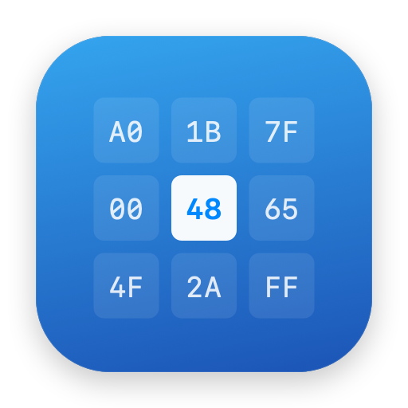

<p align="center">
  
</p>

<h1 align="center">Hexa</h1>


Hexa combines an efficient hexadecimal editor with executable structure decoding and visual byte analysis. It is built in Swift with AppKit, SwiftUI, and Apple Charts, follows the system appearance, and keeps file contents on your Mac.

Requires **macOS 14 Sonoma or later**.

## Highlights

- Fast virtualized hex and text views with insert/overwrite modes, undo/redo, bookmarks, multiple windows, and native tabs
- Exact hex/text search, nibble wildcards, replace one/all, file comparison, ASCII string extraction, and several export formats
- Typed inspector for integers, floats, bits, encodings, timestamps, and little/big endian values
- PE32/PE32+, ELF32/ELF64, and thin/universal Mach-O structure trees with headers, segments, sections, searchable fields, colored regions, and selection decoding
- Magic-byte and MIME identification using 71 built-in signatures
- Interactive entropy, byte-type, histogram, digram, and layered-distribution graphs
- SHA-256, SHA-512, MD5, CRC-32, compression/encryption heuristics, and cryptographic constant detection
- Chunked analysis and piece-table editing designed to avoid copying the complete file for ordinary viewing and edits

## Install

Download the latest `.dmg` from [GitHub Releases](../../releases), open it, and drag **Hexa** to **Applications**.

## Build from source

Install Xcode 15 or newer, or Apple Command Line Tools with Swift 5.9 or newer:

```sh
xcode-select --install
# Clone the repository using GitHub's Code button, then enter that folder.
cd /path/to/Hexa
./Scripts/build-app.sh
open build/Hexa.app
```

The build has no third-party packages, Homebrew dependencies, API keys, or network services. It creates a self-contained release app at `build/Hexa.app`. To develop in Xcode, open `Package.swift`, select the **Hexa** scheme and **My Mac**, then press **⌘R**.

Run the tests with full Xcode:

```sh
./Scripts/test.sh
```

Build a universal Apple Silicon and Intel app, or create a local DMG:

```sh
./Scripts/build-app.sh --universal
./Scripts/create-dmg.sh --universal
```

## Using Hexa

Open any regular file with **⌘O** or drag it into the window. Use **⌘1**, **⌘2**, and **⌘3** to move between the Bytes, Structure, and Analysis workspaces. Structure fields and chart regions are clickable and lead back to their exact bytes.

Parsing and detection are inspection aids. High entropy cannot by itself distinguish encryption from compression, and a cryptographic constant does not prove an algorithm is in use. Hexa does not execute opened files.

More details are available in the [user guide](docs/USER_GUIDE.md).

## Privacy and platform notes

Hexa performs editing, searching, parsing, hashing, and analysis locally. It makes no network requests and has no analytics. Settings and file-path-keyed bookmarks are stored in macOS `UserDefaults`.

The current project is distributed outside the Mac App Store and is not App Sandbox enabled. See the user guide for save metadata, large-file, parser, and accessibility limits.

## Contributing and license

Issues and focused pull requests are welcome. Please include a reproducible sample or minimal byte sequence for parser bugs, and run `./Scripts/test.sh` before submitting code. Do not attach confidential binaries to public issues.

## Screenshots


